# 🌐 BDU CONNECT

BDU CONNECT is a **university-based social media platform** designed for students and staff at **Bahir Dar University (BDU)**. It allows users to create posts, chat in real-time, share media, and build a vibrant university community — all in one modern app.

## 🧠 Project Overview

- 🧑‍🎓 **User Profiles** – Register, login, update profile photo & password
- 📸 **Create & View Posts** – Add text, photos, or videos
- 💬 **Real-time Messaging** – Private and channel-based chat
- 📂 **Media Upload** – Share images, videos, and files via Cloudinary
- 😀 **Reactions** – Emoji support for posts and messages
- 🧾 **Comments** – Full commenting system with edit/delete
- 🎥 **Video Calling** – Peer-to-peer calling via WebRTC & Socket.IO
- 💰 **payment Integration**
- 🛡️ **Authentication** – JWT-based secure login

---

## 🧱 Tech Stack

| Part     | Technology                                           |
| -------- | ---------------------------------------------------- |
| Frontend | React.js, Tailwind CSS, Zustand, Axios, React Router |
| Backend  | Node.js, Express.js, MongoDB, Mongoose               |
| Realtime | Socket.IO                                            |
| Storage  | Cloudinary (images, videos)                          |
| Auth     | JWT                                                  |

## 🖼️ Screenshots

### 🔐 Login Page

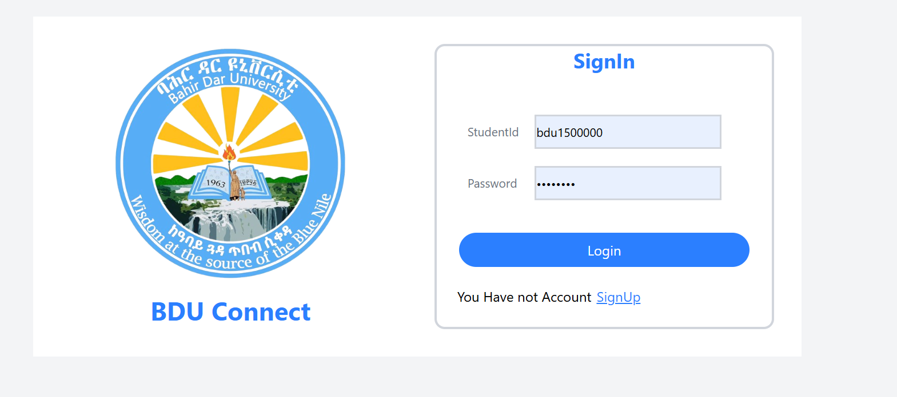

### 🆕 Signup Page

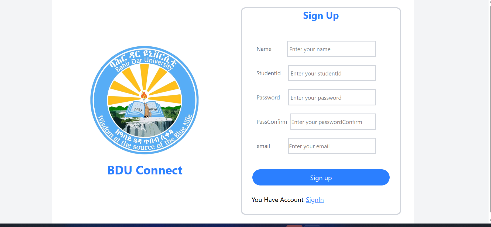

### 🏠 Home Feed

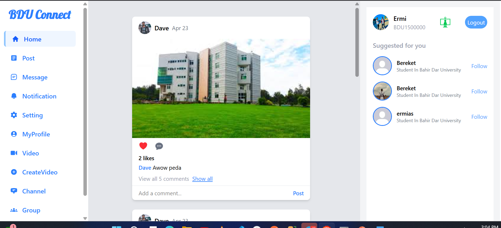

### 📝 Create Post

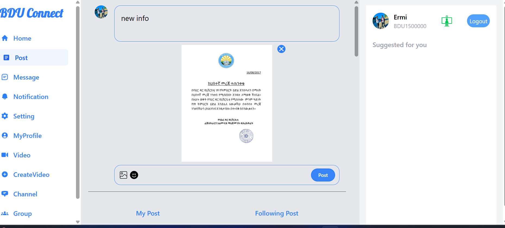

### 💬 Message Page

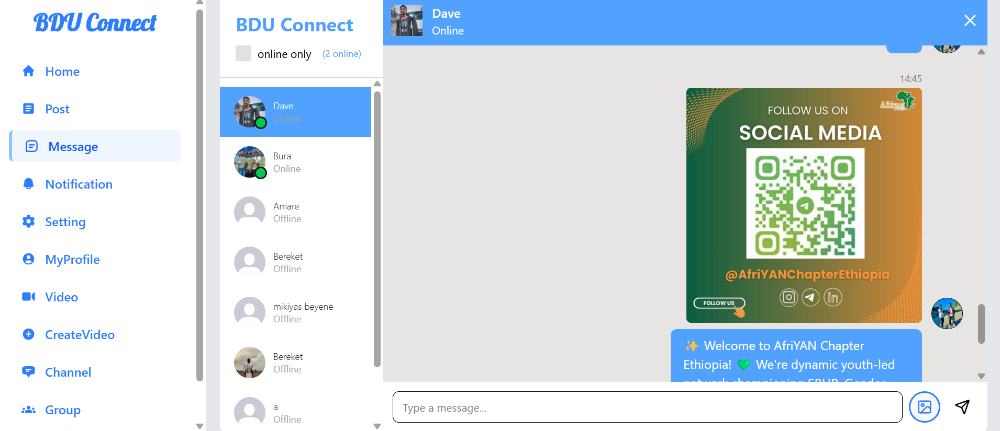

### 🎥 Video reel

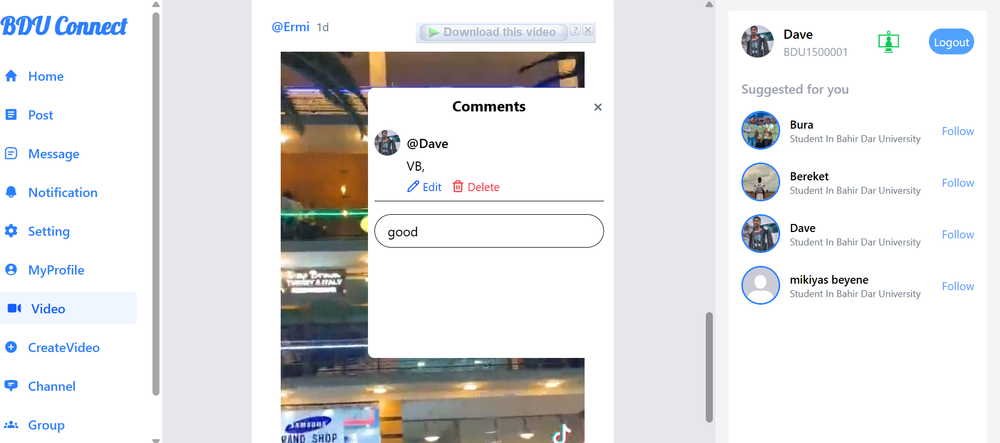

### 🧑‍🤝‍🧑 Group Page

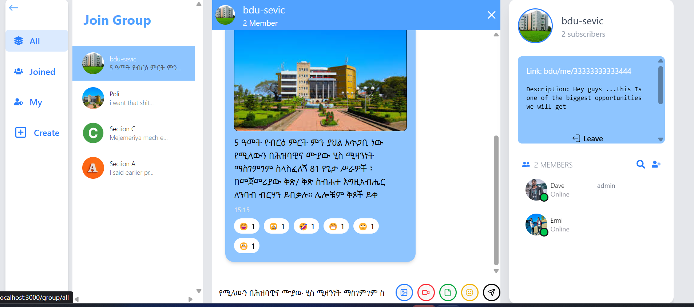

### 📢 Notifications

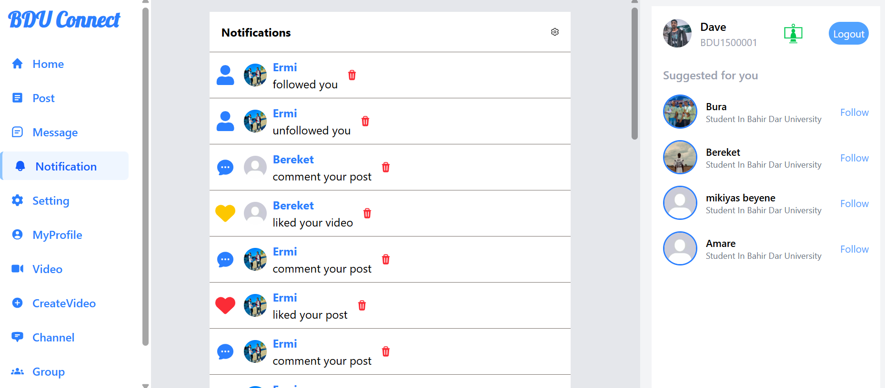

### 💡 Services List

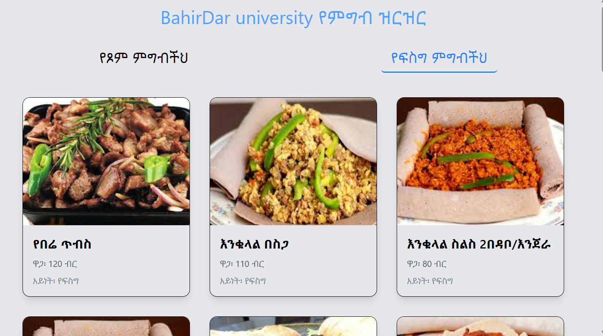

### 📄 Service Detail

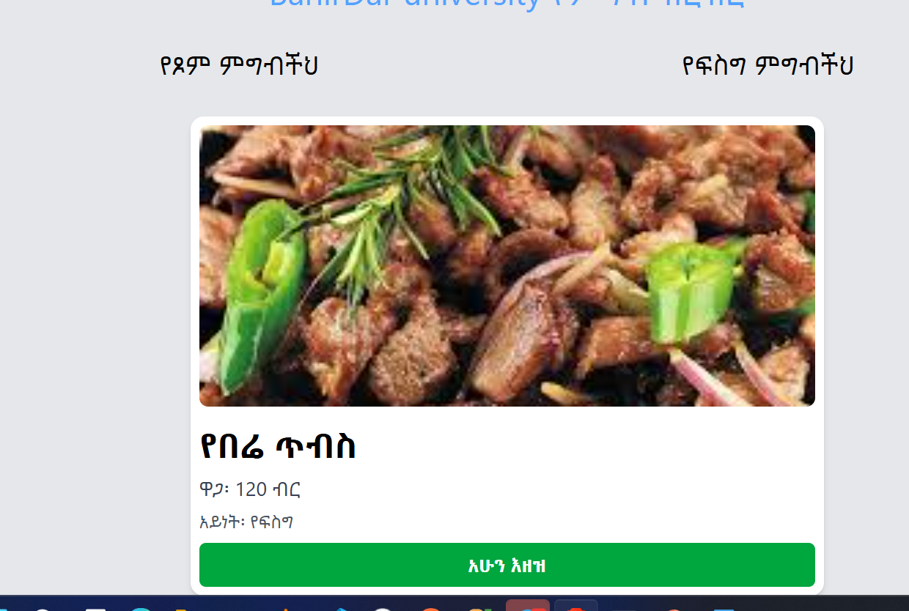

### 📃 Profile Page

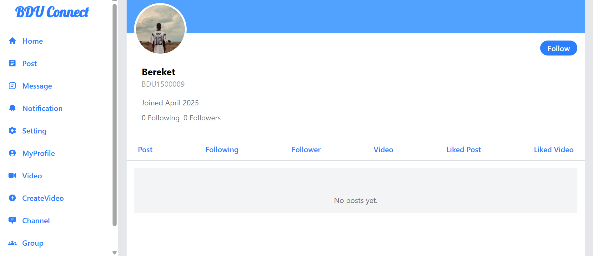

### ⚙️ Profile Settings

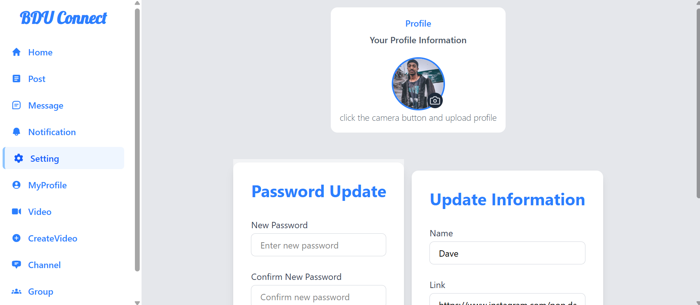

### 📺 Channels

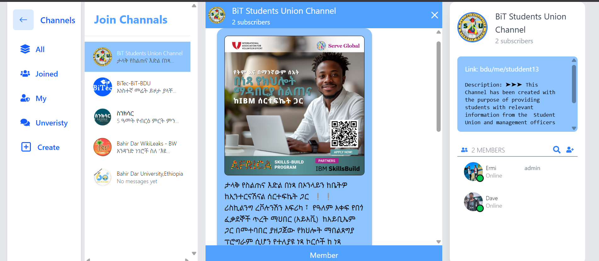

### ➕ Create Channel

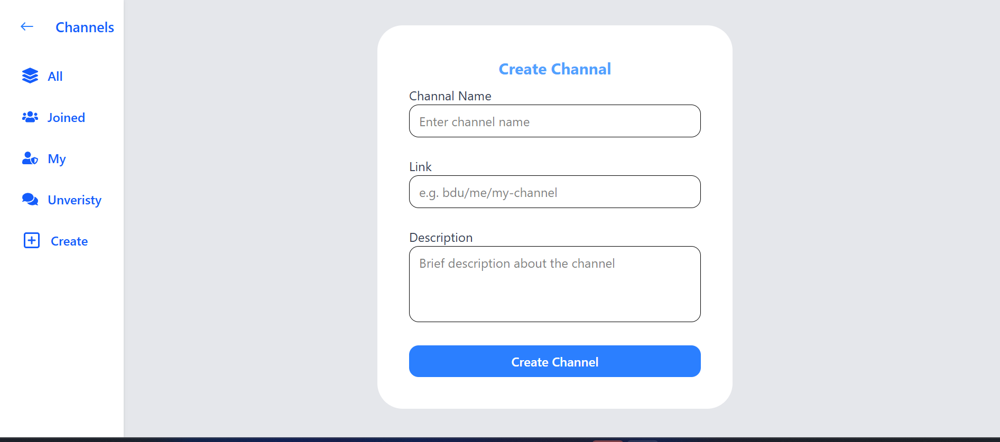

### 🛠️ Channel Settings

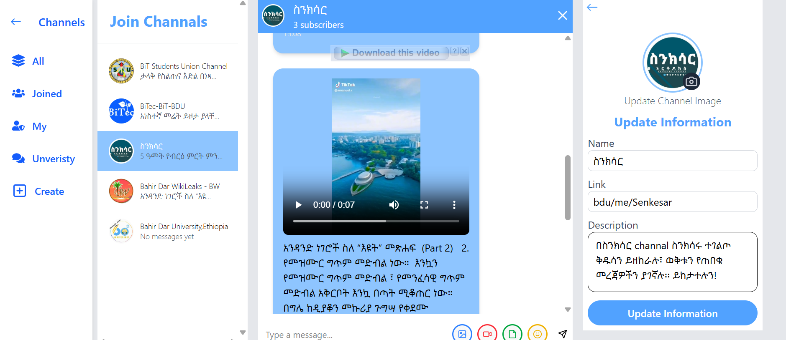

### 💬 Comment & Like Post

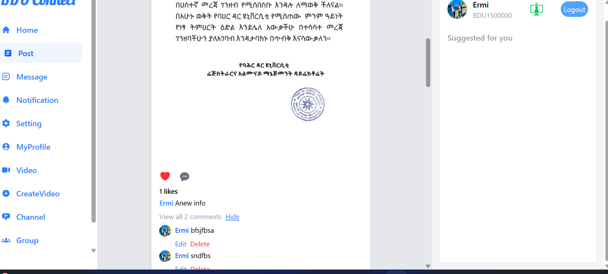

### 💬 video call

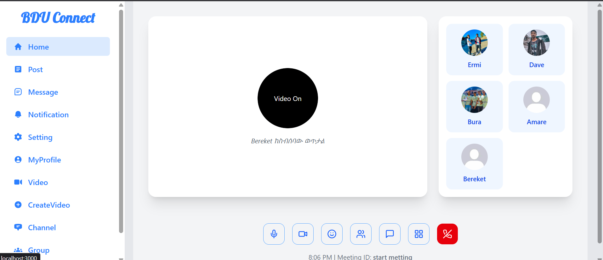

## 🚀 Getting Started

### 1️⃣ Clone the repository

```bash
git clone https://github.com/Ermias5869/BDU-Connect.git
cd BDU-Connect
```

### 2️⃣ Set up the backend

cd backend
npm install

## Create a .env file in /backend:

MONGO_URI=your_mongodb_uri
JWT_SECRET=your_jwt_secret
CLOUDINARY_CLOUD_NAME=your_cloud_name
CLOUDINARY_API_KEY=your_api_key
CLOUDINARY_API_SECRET=your_api_secret

PORT=5001
DATABASE_LOCAL=your_mongodb_uri
JWT_SECURE=your_jwt_secure
JWT_EXP=you
CLOUDINARY_CLOUD_NAME=your_cloud_name
CLOUDINARY_API_KEY=your_api_key
CLOUDINARY_API_SECRET=your_api_secret
STRIPE_PUBLISHABLE_KEY=you_stripe_publishable_key
STRIPE_SECRET_KEY=you_stripe_secret_key

## Start the backend:

npm run dev

### 3️⃣ Set up the frontend

cd ../frontend
npm install
npm run dev

The app runs on:
Frontend: http://localhost:5173
Backend: http://localhost:5000
